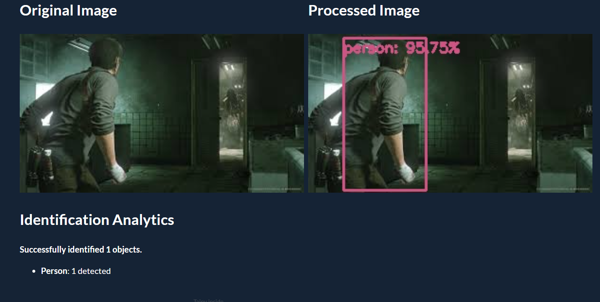
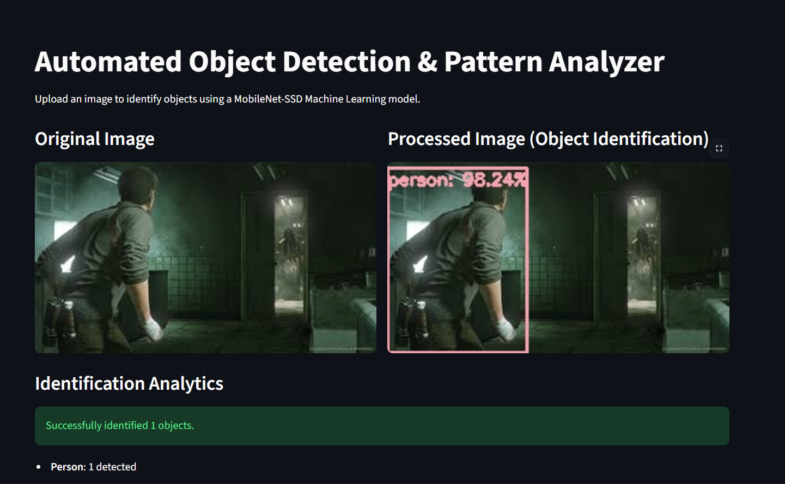
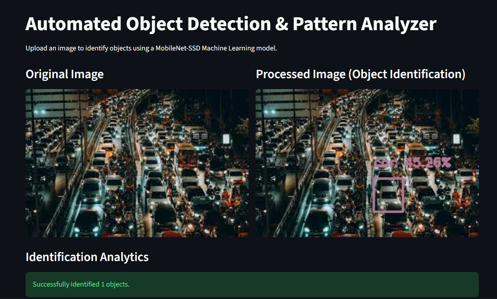

Ayushman Dhar, 23UCS087

# Object Detection GUI
Author: Ayushman Dhar, 23UCS087


A web-based interface built with Taipy and OpenCV that detects objects in images using a pre-trained MobileNet-SSD model. I built this to demonstrate how to integrate computer vision models with an event-driven frontend and analyze the resulting patterns.

## Screenshots







## What It Does
* **Image Upload:** Select an image (JPG/PNG) via the control panel.
* **Adjustable Threshold:** A slider lets you change the model's confidence threshold on the fly (e.g., set it to 0.5 to only show objects the AI is 50% sure about).
* **Object Identification:** Draws labeled bounding boxes around recognized objects.
* **Analytics:** Generates a text breakdown of how many objects were found and what category they belong to.
* **Auto-Setup:** The script automatically fetches the required `.prototxt` and `.caffemodel` files if they aren't already in the folder, so it runs right out of the box.

## Tech Stack
* **Python**
* **Taipy** (Frontend/GUI and State Management)
* **OpenCV / cv2** (Image processing and Neural Network handling)
* **NumPy** (Matrix math for bounding boxes)

## How to Run Locally

1. Make sure you have Python installed.
2. Open your terminal in the project folder and install the required packages:
   ```bash
<<<<<<< HEAD
   pip install taipy opencv-python numpy
=======
   pip install streamlit opencv-python numpy pillow
>>>>>>> e36c244b877f3029269dd28b12bcb47779e78ff1
